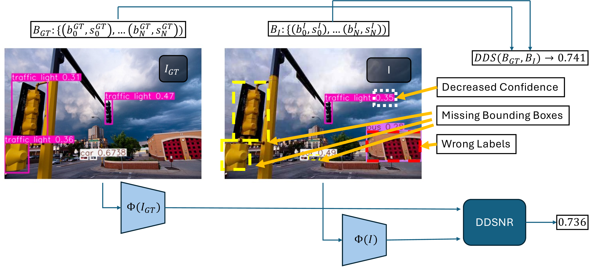
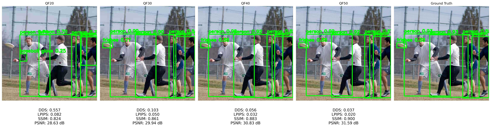
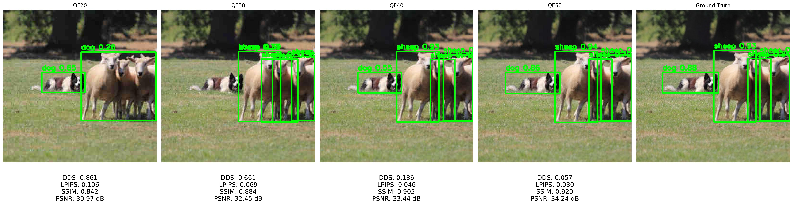
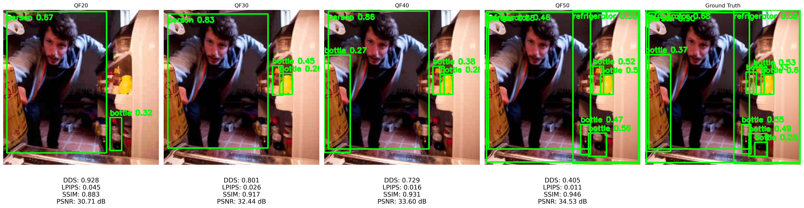
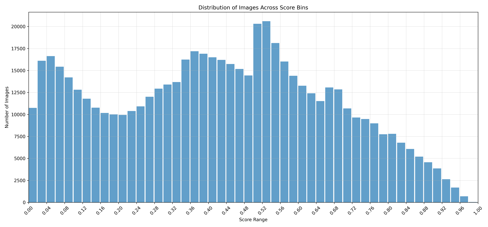
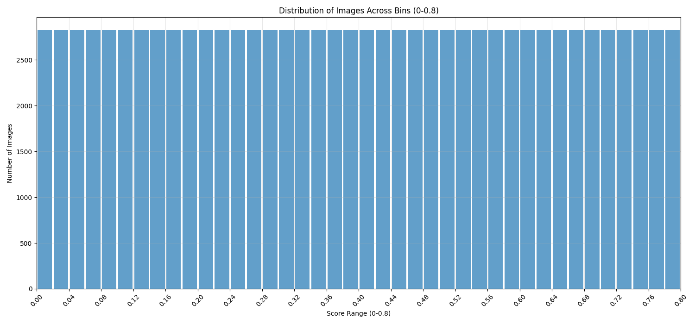

# Detection Degradation Score

## Overview

This project addresses the challenge of evaluating object detection algorithms in real-world scenarios where image artifacts (like compression, noise, or distortion) significantly impact detection performance. Traditional image quality metrics (PSNR, SSIM) and standard detection metrics (mAP) often prove inadequate for quantifying how artifacts specifically degrade object detection capabilities. We introduce a novel full-reference metric, Detection Degradation Score (DDS), designed to measure detection performance degradation induced by artifacts. Additionally, we propose the Detection Degradation Score Regression Network (DDSRN), a neural network trained to predict DDS directly from images, providing a significant computational advantage over direct DDS calculation.



The image above illustrates the core concept: when artifacts affect an image (right), object detection performance degrades through various problems including decreased confidence in detections, missing bounding boxes, and incorrect classifications. DDS quantifies these degradations with a single score (0.741 in this example), while DDSRN can predict this score (0.736) directly from the images without running the detector, providing significant computational savings.

Below are examples comparing our DDS metric with traditional metrics (LPIPS, SSIM, PSNR) at different JPEG compression rates, with the original image in the rightmost column. It can be observed that other metrics show a limited range of values despite the strong changes in object detection performance:





## The Detection Degradation Score Metric

DDS is a full-reference metric that operates directly in the "detection space" rather than pixel space. It quantifies degradation by comparing detections obtained from an artifact-affected image with those from the reference image (Ground Truth), jointly considering:

1. **Localization accuracy**: Using Intersection over Union (IoU) between bounding boxes
2. **Classification correctness**: Verifying if the predicted class matches the GT class
3. **Prediction confidence**: Evaluating confidence degradation in artifact-affected predictions

The metric produces a single scalar value between 0 and 1, where 0 indicates no degradation (perfect detection despite artifacts) and 1 indicates complete degradation (detection completely compromised). DDS penalizes both false negatives (missed detections) and false positives (spurious detections), providing a comprehensive evaluation of detection quality.


The conceptual workflow illustrated above shows how DDS operates: starting from the original (GT) and artifact-affected images, an object detector (YOLOv11-m in our implementation) processes both to generate detection predictions. These predictions are then analyzed by the DDS metric, which compares them to quantify the degradation in detection performance caused by the artifacts, producing a final DDS score.

## Detection Degradation Score Regression Network

The DDSRN aims to overcome the computational limitations of direct DDS calculation. The standard DDS calculation involves a CPU-bound matching process between detections, which becomes a significant bottleneck when processing large datasets or in real-time applications. This matching step can account for nearly 50% of the total computation time, while detector inference on GPU handles the remainder. By training a neural network to predict DDS directly, we can leverage GPU parallelism throughout the entire process.

The DDSRN architecture includes:

1. A **backbone network** (YOLOv11-m, VGG16, EfficientNetV2-M, etc.) for feature extraction
2. **Feature fusion modules** that process features from both GT and artifact-affected images 
3. **SimpleBottleneckBlock** modules for efficient feature processing with reduced parameters
4. **ResidualMLPBlock** modules for feature aggregation and score prediction
5. A **final regression head** that outputs the predicted DDS value

This neural approach provides approximately 3x acceleration compared to direct calculation while maintaining high correlation with the original metric, effectively shifting the computational workload from CPU to GPU.


## DDSRN Training Process

The training process for the DDSRN involves two parallel paths that converge at the loss calculation, as illustrated below:


During training, each image pair (GT and artifact-affected) follows two paths:
1. **DDS Calculation Path**: Both images are processed by the object detector to obtain detection predictions, which are then matched to calculate the target DDS score
2. **Neural Prediction Path**: The same images are processed by the feature extractor backbone, and these features feed into the DDSRN to predict the DDS

The training optimizes the DDSRN weights to minimize the difference between predicted and calculated DDS scores through:

1. **Loss function**: Mean Squared Error (MSE) between predicted and target DDS
2. **Optimization**: Using AdamW optimizer with weight decay and OneCycleLR scheduler
3. **Validation**: Monitoring prediction accuracy on a validation set
4. **Early stopping**: Preventing overfitting by monitoring validation loss

```bash
python train.py
```

The training process is monitored using Weights & Biases, tracking metrics like training/validation loss, prediction distribution, and learning rate.

## Dataset Generation Process

The dataset generation involves several steps:

1. **Image extraction**: Using `extract_patch_coco.py` to produce fixed-size (320×320) images from the COCO2017 dataset
   ```bash
   python helpers/extract_patch_coco.py
   ```

2. **Compression simulation**: Using `process_patches_coco.py` to create multiple JPEG-compressed versions of each image at different quality factors (20-50)
   ```bash
   python helpers/process_patches_coco.py
   ```

3. **DDS calculation**: Using `multi_dds_calculator.py` to compute DDS for each compressed image by comparing detections with the original image
   ```bash
   python helpers/multi_dds_calculator.py
   ```

When examining the distribution of DDS scores across the COCO2017 dataset with various JPEG quality factors (20-50), we observed a highly skewed distribution:



This unbalanced distribution would negatively impact the DDSRN training process, as the model would be exposed to far more examples of certain DDS ranges while rarely seeing others. To address this issue, we implemented a balancing process:

4. **Dataset balancing**: Using `dataset_balancer.py` to create a "recipe" for selecting images with specific quality factors to achieve a balanced DDS distribution
   ```bash
   python dataset_balancer.py
   ```

5. **Dataset splitting**: Using `dataset_splitter.py` to transform the unbalanced dataset into a balanced one with appropriate train/validation/test splits
   ```bash
   python dataset_splitter.py
   ```

This process results in a much more uniform distribution of DDS scores across the dataset, which is crucial for effective training of the regression network:



## Performance Evaluation

You can evaluate the DDSRN's performance on the test set:

```bash
python predict_test_set_ddsrn.py
```

For benchmarking DDS calculation speed:

```bash
python predict_test_set_dds.py
```

Comparison with baseline methods like LPIPS and SSIM:

```bash
python benchmarks/custom_lpips_test_set.py
python benchmarks/ssim_test_set.py
```

## Requirements

- Python 3.8+
- PyTorch 2.0+
- CUDA 11.8+ (for GPU acceleration)
- Ultralytics (for YOLOv11-m)
- OpenCV
- NumPy
- Scikit-image
- Weights & Biases (optional, for experiment tracking)

You can install the required packages with:

```bash
pip install torch torchvision opencv-python numpy scikit-image wandb 
pip install ultralytics
```

## Using DDS in Your Project

### Direct DDS Calculation

You can calculate the DDS metric directly for your own detection tasks:

```python
from dds_metric import calculate_dds

# Get predictions from your detector for both original and artifact-affected images
gt_predictions = detector.predict(original_image)
artifact_predictions = detector.predict(artifact_image)

# Calculate DDS
matches = match_predictions(gt_predictions, artifact_predictions)
ddscore = calculate_dds(matches, len(gt_predictions), len(artifact_predictions))

print(f"Detection Degradation Score: {ddscore}")
```

### Using the DDSRN for Fast Evaluation

Once trained, the DDSRN can be used for fast DDS estimation:

```python
from ddsrn import create_ddsrn_model
from extractor import load_feature_extractor
from backbones import Backbone

# Load model and feature extractor
model = create_ddsrn_model(
    feature_channels=Backbone.YOLO_V11_M.config.channels,
    layer_indices=Backbone.YOLO_V11_M.config.indices
)
model.load_state_dict(torch.load("checkpoints/best_model.pt")["model_state_dict"])
model.eval()

extractor = load_feature_extractor(Backbone.YOLO_V11_M, weights_path="yolo11m.pt")

# Extract features from images
gt_features, mod_features = extractor.extract_features(original_image, artifact_image)

# Predict DDS
with torch.no_grad():
    predicted_dds = model(gt_features, mod_features).item()

print(f"Predicted Detection Degradation Score: {predicted_dds}")
```

## Advanced Usage

### Custom Backbone Support

The DDSRN architecture supports multiple backbone networks:

```python
# Available backbone options
from backbones import Backbone

# YOLOv11-m (default)
backbone = Backbone.YOLO_V11_M

# VGG16
backbone = Backbone.VGG_16

# MobileNetV3-Large (lighter option)
backbone = Backbone.MOBILENET_V3_L

# EfficientNetV2-Medium (balanced performance)
backbone = Backbone.EFFICIENTNET_V2_M
```

### Extending to Other Artifacts

While our implementation focuses on JPEG compression artifacts, the DDS metric and DDSRN can be easily extended to other types of artifacts:

1. Generate images with the desired artifacts (blur, noise, etc.)
2. Calculate DDS for these images using the original metric
3. Train the DDSRN on the new dataset

### Integration with Image Enhancement Pipelines

The DDS metric can guide image enhancement algorithms specifically optimized for object detection:

```python
# Example: using DDS as a loss function for an enhancement network
def detection_oriented_loss(enhanced_image, original_image, target_image):
    # Calculate standard perceptual loss
    perceptual_loss = perceptual_loss_fn(enhanced_image, target_image)
    
    # Calculate DDS loss (lower is better)
    gt_preds = detector(target_image)
    enhanced_preds = detector(enhanced_image)
    matches = match_predictions(gt_preds, enhanced_preds)
    dds_loss = calculate_dds(matches, len(gt_preds), len(enhanced_preds))
    
    # Combined loss
    total_loss = perceptual_loss + lambda_dds * dds_loss
    return total_loss
```

## Experimental Results

Our experimental validation, conducted using the COCO2017 dataset and simulating JPEG compression artifacts with YOLOv11-m as the detector, demonstrates the DDS's sensitivity to variations in image quality and the DDSRN's effectiveness in predicting the metric:

| Method | MAE ↓ | Pearson Correlation ↑ | Spearman Correlation ↑ | Inference Speed (img/s) ↑ |
|--------|-------|-------------------------|---------------------------|---------------------------|
| SSIM | 0.4791 | 0.3241 | 0.3056 | 198.32 |
| LPIPS | 0.2970 | 0.4183 | 0.4276 | 184.57 |
| DDSRN (VGG16) | 0.1648 | 0.5018 | 0.4923 | 268.04 |
| DDSRN (EfficientNetV2-M) | 0.1659 | 0.4851 | 0.4775 | 243.73 |
| DDSRN (YOLOv11-m) | **0.1379** | **0.6509** | **0.6317** | 203.71 |
| DDS (CPU+GPU) | 0.0000 | 1.0000 | 1.0000 | 72.31 |

These results show that our DDSRN approach provides a significant speedup over direct DDS calculation while maintaining a strong correlation with the original metric.

## Project Structure

```
.
├── backbones.py                     # Backbone configurations
├── dataloader.py                    # Dataset loading utilities
├── dataset_balancer.py              # Balance dataset distribution 
├── dataset_splitter.py              # Split dataset into train/val/test
├── dds_metric.py                    # Implementation of DDS metric
├── ddsrn.py                         # DDSRN model implementation
├── extractor.py                     # Feature extraction utilities
├── predict_test_set_dds.py          # DDS calculation benchmark
├── predict_test_set_ddsrn.py        # DDSRN evaluation script
├── train.py                         # DDSRN training script
├── helpers/
│   ├── extract_patch_coco.py        # Extract patches from COCO
│   ├── multi_dds_calculator.py      # DDS calculator for multiple compression
│   ├── multi_prediction_extractor.py # Extract predictions from YOLO
│   └── process_patches_coco.py      # JPEG compression simulation
├── utils/
│   ├── bin_distribution_visualizer.py # Visualization utilities
└── benchmarks/
    ├── custom_lpips_test_set.py     # LPIPS comparison 
    └── ssim_test_set.py             # SSIM comparison
```


## Citation

If you use this work in your research, please cite:

```bibtex
@misc{damerini2025dds,
  author = {Damerini, Jacopo},
  title = {DetectionDegradationScore: A Full-Reference Metric for Object Detection Quality Assessment},
  year = {2025},
  publisher = {GitHub},
  journal = {GitHub repository},
  howpublished = {\url{https://github.com/jcpdmr/DetectionDegradationScore}}
}
```

## License

This project is licensed under the MIT License - see the LICENSE file for details.

## Acknowledgments

* This work was conducted at the University of Florence under the supervision of Prof. Marco Bertini and Prof. Lorenzo Seidenari
* We thank the COCO dataset creators for providing the images used in our experiments
* The YOLOv11-m model is provided by Ultralytics